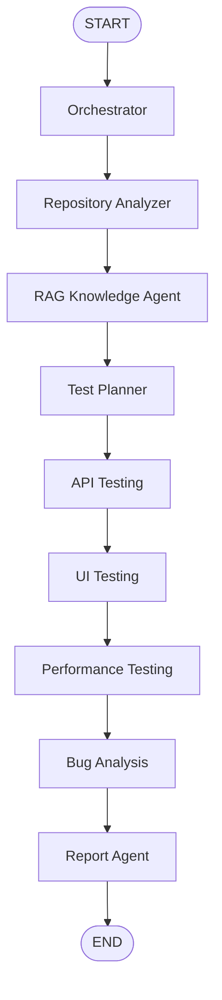

# LangGraph-Based Multi-Agent System for Automated Software Testing

This is the PFA project foundation for a LangGraph-based multi-agent system that
will automate software testing progressively.

## Project Objective

The final MVP accepts a GitHub repository URL or local repository path, analyzes
the project, retrieves repository context, plans API/UI/performance tests,
executes safe tests against a target URL, classifies anomalies, and generates a
dashboard-ready HTML report.

The milestone sections below preserve the project history. The current system
state is summarized in **Final MVP Workflow**.

## Milestone 1

Milestone 1 implements the clean foundation and the standalone Orchestrator
Agent. The Orchestrator validates the user request, selects the future agents
that should run later, saves a structured JSON result, and runs in a minimal
LangGraph workflow:

```text
START -> orchestrator -> END
```

## Milestone 2

Milestone 2 adds the standalone Repository Analyzer Agent. It inspects a local
or cloned repository with deterministic heuristics and reports compact metadata:
language, framework, package manager, test evidence, candidate docs, candidate
API files, candidate UI files, discovered endpoints, UI flows, and risks.

It does not generate tests, run the target project, execute arbitrary repository
code, call LLM APIs, use RAG, or use MCP.

## Milestone 3

Milestone 3 connects the Orchestrator and Repository Analyzer in the main
LangGraph workflow:

```text
START -> orchestrator -> repo_analyzer -> END
```

The edge after Orchestrator is conditional. Repository Analyzer runs only when
`repository_analyzer` is selected and the repository input is usable. A valid
local `repo_path` is preferred when provided; otherwise a valid GitHub/Git URL
can be cloned for read-only analysis.

## Milestone 4

Milestone 4 adds the standalone RAG Knowledge Agent. It reads selected
repository files, chunks them, embeds chunks with a deterministic local hash
embedding backend, stores a JSON vector index, and retrieves the top context for
a testing query.

The RAG Agent does not call LLM APIs and does not generate tests yet. Its job is
only to prepare grounded context for a future Test Planner.

```text
documents -> chunks -> local vectors -> vector store -> retrieved context
```

## Milestone 5

Milestone 5 connects RAG to the main LangGraph workflow:

```text
START -> orchestrator -> repo_analyzer -> rag -> END
```

The edge after Repository Analyzer is conditional. RAG runs only if Repository
Analyzer produced usable `repo_path`, `project_info`, and `indexed_documents`.
The system retrieves context, but it still does not generate or run tests.

## Milestone 6

Milestone 6 adds the standalone Test Planner Agent. It reads `project_info`,
`discovered_endpoints`, `discovered_ui_flows`, `retrieved_context`, and
`user_preferences` to generate a grounded `test_plan`.

The planner does not run tests and does not generate executable pytest,
Selenium, or Locust code yet. Every planned test must be grounded in repository
evidence, and invented endpoints are filtered out before the plan is saved.

The planner has a LLM planner mode that works without API keys.
Optional LLM mode can use Groq or Mistral only through environment variables,
and secrets are never written to logs, notebooks, or JSON artifacts.

At this milestone, the planner worked alone through its own mini workflow:

```text
START -> test_planner -> END
```

## Milestone 7

Milestone 7 connects the Test Planner to the main LangGraph workflow:

```text
START -> orchestrator -> repo_analyzer -> rag -> test_planner -> END
```

The system can now validate the user request, analyze the repository, retrieve
context using RAG, and generate a grounded test plan. It still does not execute
tests or generate executable pytest/Selenium code.

## Milestone 8

Milestone 8 adds the standalone API Testing Agent. It reads API test cases from
`test_plan`, executes them against `target_url` using HTTP requests, measures
duration, compares responses with planned expectations, and saves
`api_result.json`.

The API Agent works alone first through its own mini workflow:

```text
START -> api_testing -> END
```

At that milestone, it was not integrated into the main workflow yet. The main
workflow still remained:

```text
START -> orchestrator -> repo_analyzer -> rag -> test_planner -> END
```

## Milestone 9

Milestone 9 connects API Testing Agent to the main LangGraph workflow:

```text
START -> orchestrator -> repo_analyzer -> rag -> test_planner -> api_testing -> END
```

The system can now validate the user request, analyze the repository, retrieve
context using RAG, generate a grounded test plan, execute planned API tests
against `target_url`, and save `api_result.json`.

By default, the integrated workflow executes safe API methods only. Mutating
methods `POST`, `PUT`, `PATCH`, and `DELETE` are skipped unless
`--allow-mutating-api-tests` is passed. If the target app is not running, API
failures are classified as `environment_error`.

## Milestone 10

Milestone 10 adds the standalone Bug Analysis Agent. It reads API test results
from `api_result.json` or State, applies deterministic rules, classifies
anomalies, assigns severity, generates recommendations, and saves
`bug_result.json`.

The Bug Agent works alone first through its own mini workflow:

```text
START -> bug_analysis -> END
```

It is not integrated into the main workflow yet. The current main workflow
remains:

```text
START -> orchestrator -> repo_analyzer -> rag -> test_planner -> api_testing -> END
```

## Milestone 11

Milestone 11 connects Bug Analysis Agent to the main LangGraph workflow:

```text
START -> orchestrator -> repo_analyzer -> rag -> test_planner -> api_testing -> bug_analysis -> END
```

The system can now validate the user request, analyze the repository, retrieve
context using RAG, generate a grounded test plan, execute planned API tests
against `target_url`, classify API anomalies and failures, generate
recommendations, and save `bug_result.json`.

Bug Analysis runs after API Testing if `api_result.json` or `api_results`
exist.

## Milestone 12

Milestone 12 adds the standalone Report Agent. It reads previous run artifacts
such as `project_info.json`, `test_plan.json`, `api_result.json`,
`bug_result.json`, and `workflow_state.json`.

It computes KPIs, builds `final_results.json`, renders an HTML report, prepares
`dashboard_payload`, and saves:

```text
results/runs/<run_id>/final_results.json
results/runs/<run_id>/report_result.json
reports/generated/report_<run_id>.html
```

The Report Agent works alone first through its own mini workflow:

```text
START -> report -> END
```

It is not integrated into the main workflow yet. The current main workflow
remains:

```text
START -> orchestrator -> repo_analyzer -> rag -> test_planner -> api_testing -> bug_analysis -> END
```

## Milestone 13

Milestone 13 connects Report Agent to the main LangGraph workflow:

```text
START -> orchestrator -> repo_analyzer -> rag -> test_planner -> api_testing -> bug_analysis -> report -> END
```

The system can now validate the user request, analyze the repository, retrieve
context using RAG, generate a grounded test plan, execute planned API tests
against `target_url`, classify API anomalies and failures, generate
recommendations, aggregate all outputs into `final_results.json`, render an
HTML report, and prepare `dashboard_payload`.

Report Agent runs after Bug Analysis if reportable artifacts exist.

## Milestone 14

Milestone 14 adds the Dashboard / Interface MVP.

The interface allows the user to enter a GitHub repo URL or local repo path,
enter the target app URL, choose testing preferences, launch the full LangGraph
workflow, view the generated report directly inside the web interface, and
inspect recent runs and artifact paths.

Current main workflow remains:

```text
START -> orchestrator -> repo_analyzer -> rag -> test_planner -> api_testing -> bug_analysis -> report -> END
```

The dashboard does not add new testing agents. It only calls the existing
workflow and displays its results.

Dashboard command:

```powershell
python app.py
```

Open:

```text
http://127.0.0.1:5000
```

Key workflow outputs displayed by the dashboard:

```text
results/runs/<run_id>/final_results.json
results/runs/<run_id>/report_result.json
reports/generated/report_<run_id>.html
results/runs/<run_id>/workflow_state.json
```

## Milestone 15

Milestone 15 adds a standalone MCP Testing Tools Server.

The MCP server exposes reusable testing tools through FastMCP:

- `health_check`
- `validate_url_tool`
- `list_project_files_tool`
- `read_text_file_tool`
- `clone_repository_tool`
- `send_http_request_tool`
- `generate_html_report_tool`
- `save_json_artifact_tool`

It runs with local stdio transport:

```powershell
python mcp_servers/testing_tools_server.py
```

Self-test:

```powershell
python mcp_servers/testing_tools_server.py --self-test
```

Manual inspector:

```powershell
npx @modelcontextprotocol/inspector python mcp_servers/testing_tools_server.py
```

The MCP server is not integrated into the LangGraph workflow yet. LangGraph
State remains the workflow memory; MCP is the standardized tool-access layer.
MCP will later replace or wrap selected local tools.

Current main workflow remains:

```text
START -> orchestrator -> repo_analyzer -> rag -> test_planner -> api_testing -> bug_analysis -> report -> END
```

Dashboard still works:

```powershell
python app.py
```

## Milestone 16

Milestone 16 integrates selected MCP tools into existing agents in a safe,
optional way.

MCP is controlled by:

```powershell
--use-mcp-tools
```

Agents that can use MCP optionally:

- Repository Analyzer
- API Testing Agent
- Report Agent

Local tools remain the default. If MCP fails, the system logs the fallback in
agent metadata and continues with local tools.

Current main workflow remains:

```text
START -> orchestrator -> repo_analyzer -> rag -> test_planner -> api_testing -> bug_analysis -> report -> END
```

## Milestone 17

Milestone 17 adds the standalone UI Testing Agent.

It reads UI test cases from `test_plan` and executes them against `target_url`
using Selenium in headless mode. It saves `ui_result.json` and captures
screenshots on failure when possible.

The UI Agent works alone first through its own mini workflow:

```text
START -> ui_testing -> END
```

It is not integrated into the main workflow yet.

Current main workflow remains:

```text
START -> orchestrator -> repo_analyzer -> rag -> test_planner -> api_testing -> bug_analysis -> report -> END
```

## Milestone 18

Milestone 18 connects UI Testing Agent to the main LangGraph workflow.

The main workflow becomes:

```text
START -> orchestrator -> repo_analyzer -> rag -> test_planner -> api_testing -> ui_testing -> bug_analysis -> report -> END
```

The system can now analyze the repository, retrieve RAG context, generate a
grounded test plan, execute API tests, execute UI tests with Selenium, capture
UI screenshots on failure, classify API and UI anomalies, generate a final HTML
report, and display the report in the dashboard.

## Milestone 19

Milestone 19 adds the standalone Performance Testing Agent.

It reads `performance_tests` from `test_plan` or infers a safe GET/HEAD
endpoint, runs a small Locust-based load test, collects performance metrics,
evaluates thresholds, and saves `performance_result.json`.

The Performance Agent works alone first through its own mini workflow:

```text
START -> performance_testing -> END
```

It is not integrated into the main workflow yet.

Current main workflow remains:

```text
START -> orchestrator -> repo_analyzer -> rag -> test_planner -> api_testing -> ui_testing -> bug_analysis -> report -> END
```

## Milestone 20

Milestone 20 connects Performance Testing Agent to the main LangGraph workflow.

The main workflow becomes:

```text
START -> orchestrator -> repo_analyzer -> rag -> test_planner -> api_testing -> ui_testing -> performance_testing -> bug_analysis -> report -> END
```

The system can now analyze the repository, retrieve RAG context, generate a
grounded test plan, execute API tests, execute UI tests, execute safe
performance tests with Locust, classify API, UI, and performance anomalies,
generate a final HTML report, and display the report in the dashboard.

## Final MVP Workflow

The final MVP workflow is:

```text
START -> orchestrator -> repo_analyzer -> rag -> test_planner -> api_testing -> ui_testing -> performance_testing -> bug_analysis -> report -> END
```



This workflow uses Groq/Mistral LLM planning through environment variables.
The deterministic planner remains only as an internal safety fallback if the
LLM call fails.

## Why LangGraph

The project uses LangGraph because the professor course models agent workflows
with State, Nodes, and Edges. This keeps orchestration explicit and makes later
multi-agent routing easier to test.

## Why Agents Are Built One By One

Each agent is implemented and tested alone first, then connected only after its
standalone behavior is verified. The current project still avoids required LLM
calls and keeps performance testing safe with small Locust loads.

## Security

Never commit API keys. The real `.env` file is ignored by Git. Use
`.env.example` only as a placeholder template:

```powershell
copy .env.example .env
```

Linux/macOS:

```bash
cp .env.example .env
```

## Installation

```powershell
cd sma_test_automation
python -m venv .venv
.venv\Scripts\activate
pip install -r requirements.txt
pip install -e .
```

Linux/macOS activation:

```bash
source .venv/bin/activate
```

## Notebook Environment Setup

Use the project virtual environment as the VS Code notebook kernel.

Windows PowerShell:

```powershell
cd sma_test_automation
python -m venv .venv
.venv\Scripts\activate
pip install -r requirements.txt
pip install -e .
python scripts/setup_notebook_kernel.py
```

Alternative helper:

```powershell
.\scripts\setup_notebooks.ps1
```

Then in VS Code:

1. Open a notebook.
2. Click Select Kernel.
3. Choose Python Environments.
4. Select `.venv\Scripts\python.exe` if visible.
5. If it is not visible, choose Jupyter Kernel.
6. Select `Python (sma-test-auto)`.

Validate the notebook environment:

```powershell
python scripts/validate_notebook_env.py
```

Validate LLM readiness without printing secrets:

```powershell
python scripts/validate_llm_config.py
```

Linux/macOS:

```bash
cd sma_test_automation
python -m venv .venv
source .venv/bin/activate
pip install -r requirements.txt
pip install -e .
python scripts/setup_notebook_kernel.py
```

Alternative helper:

```bash
bash scripts/setup_notebooks.sh
```

Linux/macOS users should select `.venv/bin/python` if choosing the interpreter
directly.

Troubleshooting:

- If VS Code still does not show the kernel, press `Ctrl+Shift+P`, run
  `Python: Select Interpreter`, choose `.venv\Scripts\python.exe`, then run
  `Developer: Reload Window`, reopen the notebook, and select
  `Python (sma-test-auto)`.
- If `import test_auto` fails, run `pip install -e .` and confirm that the
  selected kernel is the `.venv` kernel.
- If `jupyter` or `ipykernel` is missing, run `pip install jupyter ipykernel`.

## Run Tests

```powershell
pytest
```

Run final smoke checks:

```powershell
python scripts/final_smoke_test.py
python scripts/validate_notebook_env.py
python scripts/check_no_secrets.py
python scripts/validate_github_input.py --repo-url "https://github.com/Vitaee/DjangoRestAPI"
python scripts/validate_llm_config.py
python mcp_servers/testing_tools_server.py --self-test
```

## Start Dashboard

```powershell
python app.py
```

Then open:

```text
http://127.0.0.1:5000
```

## GitHub Repository Input

For public repositories, paste a normal GitHub URL in the dashboard field named
`GitHub Repository URL`. No GitHub API key is required because the analyzer uses
safe Git clone/read-only inspection.

Example:

```text
https://github.com/Vitaee/DjangoRestAPI
```

For private repositories, optional future support can use `GITHUB_TOKEN` from
`.env`. Never paste tokens into the dashboard, notebooks, or command output.
If both `repo_path` and `repo_url` are provided, the local path is preferred.

Validate a repository URL safely:

```powershell
python scripts/validate_github_input.py --repo-url "https://github.com/Vitaee/DjangoRestAPI"
```

## LLM Configuration

The planner uses Groq or Mistral by default through environment variables. The deterministic planner remains an internal fallback if the LLM call fails. Validation scripts print booleans/model names only, never raw keys.

```powershell
python scripts/validate_llm_config.py
python scripts/llm_planner_smoke_test.py
```

To make one tiny LLM planner smoke-test call after configuring keys:

```powershell
python scripts/llm_planner_smoke_test.py --use-llm
```

## Run MCP Testing Tools Server

Run the server over stdio:

```powershell
python mcp_servers/testing_tools_server.py
```

Run the MCP self-test:

```powershell
python mcp_servers/testing_tools_server.py --self-test
```

Inspect manually with the MCP inspector:

```powershell
npx @modelcontextprotocol/inspector python mcp_servers/testing_tools_server.py
```

## Run Orchestrator Alone

```powershell
python -m test_auto.agents.orchestrator --repo-url "https://github.com/example/repo" --target-url "http://localhost:8000" --test-types api ui --execution-mode parallel
```

## Run Integrated LangGraph Workflow

```powershell
python -m test_auto.main --repo-url "https://github.com/Vitaee/DjangoRestAPI" --target-url "http://localhost:8000" --test-types api ui --execution-mode sequential
```

Run with a local repository:

```powershell
python -m test_auto.main --repo-path "../DjangoRestAPI" --target-url "http://localhost:8000" --test-types api ui --execution-mode sequential
```

Run the integrated workflow with RAG focus:

```powershell
python -m test_auto.main --repo-url "https://github.com/Vitaee/DjangoRestAPI" --target-url "http://localhost:8000" --test-types api ui --execution-mode sequential --focus "JWT authentication todo CRUD API tests"
```

Run the full workflow but skip UI testing:

```powershell
python -m test_auto.main --repo-url "https://github.com/Vitaee/DjangoRestAPI" --target-url "http://localhost:8000" --test-types api ui --execution-mode sequential --focus "JWT authentication todo CRUD API tests" --skip-ui-testing
```

Run the full workflow with MCP tools enabled:

```powershell
python -m test_auto.main --repo-url "https://github.com/Vitaee/DjangoRestAPI" --target-url "http://localhost:8000" --test-types api ui --execution-mode sequential --focus "JWT authentication todo CRUD API tests" --use-mcp-tools
```

Run the full workflow with API, UI, and Performance testing:

```powershell
python -m test_auto.main --repo-url "https://github.com/Vitaee/DjangoRestAPI" --target-url "http://localhost:8000" --test-types api ui performance --execution-mode sequential --focus "JWT authentication todo CRUD API tests"
```

Run the full workflow but skip Performance testing:

```powershell
python -m test_auto.main --repo-url "https://github.com/Vitaee/DjangoRestAPI" --target-url "http://localhost:8000" --test-types api ui performance --execution-mode sequential --focus "JWT authentication todo CRUD API tests" --skip-performance-testing
```

Run the integrated workflow allowing mutating API tests:

```powershell
python -m test_auto.main --repo-url "https://github.com/Vitaee/DjangoRestAPI" --target-url "http://localhost:8000" --test-types api ui --execution-mode sequential --focus "JWT authentication todo CRUD API tests" --allow-mutating-api-tests
```

Run the integrated workflow but skip API execution:

```powershell
python -m test_auto.main --repo-url "https://github.com/Vitaee/DjangoRestAPI" --target-url "http://localhost:8000" --test-types api ui --execution-mode sequential --focus "JWT authentication todo CRUD API tests" --skip-api-testing
```

Run the integrated workflow and skip Bug Analysis:

```powershell
python -m test_auto.main --repo-url "https://github.com/Vitaee/DjangoRestAPI" --target-url "http://localhost:8000" --test-types api ui --execution-mode sequential --focus "JWT authentication todo CRUD API tests" --skip-bug-analysis
```

Run the integrated workflow and skip report generation:

```powershell
python -m test_auto.main --repo-url "https://github.com/Vitaee/DjangoRestAPI" --target-url "http://localhost:8000" --test-types api ui --execution-mode sequential --focus "JWT authentication todo CRUD API tests" --skip-report
```

Run the integrated workflow with a local repo and RAG focus:

```powershell
python -m test_auto.main --repo-path "../DjangoRestAPI" --target-url "http://localhost:8000" --test-types api ui --execution-mode sequential --focus "JWT authentication todo CRUD API tests"
```

## Run Repository Analyzer Alone

Analyze a local repository:

```powershell
python -m test_auto.agents.repo_analyzer --repo-path "../some_target_repo"
```

Analyze a GitHub repository:

```powershell
python -m test_auto.agents.repo_analyzer --repo-url "https://github.com/example/todo-app"
```

The analyzer writes:

```text
results/runs/<run_id>/repo_analyzer_result.json
results/runs/<run_id>/project_info.json
```

## Run RAG Knowledge Agent Alone

Run on a local repository:

```powershell
python -m test_auto.agents.rag_agent --repo-path "../DjangoRestAPI" --query "JWT authentication todo CRUD API tests"
```

Run on the target GitHub repository:

```powershell
python -m test_auto.agents.rag_agent --repo-url "https://github.com/Vitaee/DjangoRestAPI" --query "JWT authentication todo CRUD API tests"
```

Run the mini RAG workflow from Python:

```powershell
python -c "from test_auto.graph.rag_workflow import run_rag_workflow; print(run_rag_workflow({'repo_url': 'https://github.com/Vitaee/DjangoRestAPI', 'user_preferences': {'focus': 'JWT authentication todo CRUD API tests'}, 'errors': [], 'agent_logs': []}))"
```

The RAG Agent writes:

```text
results/runs/<run_id>/rag_result.json
results/runs/<run_id>/retrieved_context.json
results/runs/<run_id>/rag_index/chunks.json
results/runs/<run_id>/rag_index/vectors.json
results/runs/<run_id>/rag_index/manifest.json
```

## Run Test Planner Agent Alone

Run from a previous workflow run directory:

```powershell
python -m test_auto.agents.test_planner --run-dir results/runs/<run_id>
```

Run from a context JSON file:

```powershell
python -m test_auto.agents.test_planner --context-json path/to/context.json
```

The planner writes:

```text
results/runs/<run_id>/test_plan.json
results/runs/<run_id>/test_planner_result.json
```

## Run API Testing Agent Alone

Run from a previous workflow run directory:

```powershell
python -m test_auto.agents.api_testing_agent --run-dir results/runs/<run_id> --target-url "http://localhost:8000"
```

Run from an explicit test plan:

```powershell
python -m test_auto.agents.api_testing_agent --test-plan results/runs/<run_id>/test_plan.json --target-url "http://localhost:8000"
```

Run the mini API workflow from Python:

```powershell
python -c "from test_auto.graph.api_testing_workflow import run_api_testing_workflow; print(run_api_testing_workflow({'target_url': 'http://localhost:8000', 'test_plan': {'api_tests': []}, 'errors': [], 'agent_logs': []}))"
```

The API Agent writes:

```text
results/runs/<run_id>/api_result.json
```

## Run UI Testing Agent Alone

Run from a previous workflow run directory:

```powershell
python -m test_auto.agents.ui_testing_agent --run-dir results/runs/<run_id> --target-url "http://localhost:8000"
```

Run from an explicit test plan:

```powershell
python -m test_auto.agents.ui_testing_agent --test-plan results/runs/<run_id>/test_plan.json --target-url "http://localhost:8000"
```

Run headed for local debugging:

```powershell
python -m test_auto.agents.ui_testing_agent --test-plan results/runs/<run_id>/test_plan.json --target-url "http://localhost:8000" --headed
```

Run the mini UI workflow from Python:

```powershell
python -c "from test_auto.graph.ui_testing_workflow import run_ui_testing_workflow; print(run_ui_testing_workflow({'target_url': 'http://localhost:8000', 'test_plan': {'ui_tests': []}, 'errors': [], 'agent_logs': []}))"
```

The UI Agent writes:

```text
results/runs/<run_id>/ui_result.json
results/runs/<run_id>/screenshots/
```

## Run Performance Testing Agent Alone

Run from a previous workflow run directory:

```powershell
python -m test_auto.agents.performance_testing_agent --run-dir results/runs/<run_id> --target-url "http://localhost:8000"
```

Run from an explicit test plan:

```powershell
python -m test_auto.agents.performance_testing_agent --test-plan results/runs/<run_id>/test_plan.json --target-url "http://localhost:8000"
```

Run the mini Performance workflow from Python:

```powershell
python -c "from test_auto.graph.performance_testing_workflow import run_performance_testing_workflow; print(run_performance_testing_workflow({'target_url': 'http://localhost:8000', 'test_plan': {'performance_tests': []}, 'errors': [], 'agent_logs': []}))"
```

The Performance Agent writes:

```text
results/runs/<run_id>/performance_result.json
results/runs/<run_id>/performance/
```

## Final Demo Guide

The final demo checklist is documented in:

```text
docs/final_demo_guide.md
docs/demo_script.md
docs/final_checklist.md
docs/final_architecture.md
docs/presentation_outline.md
```

Recommended demo order:

1. Validate the environment and final smoke checks.
2. Start the dashboard with `python app.py`.
3. Run the full workflow with API, UI, and Performance selected.
4. Open the generated HTML report from the dashboard.
5. Show the notebook trace files for milestone evidence.

Final CLI demo command:

```powershell
python -m test_auto.main --repo-url "https://github.com/Vitaee/DjangoRestAPI" --target-url "http://localhost:8000" --test-types api ui performance --execution-mode sequential --focus "JWT authentication todo CRUD API tests"
```

## Run Bug Analysis Agent Alone

Run from a previous workflow run directory:

```powershell
python -m test_auto.agents.bug_analysis_agent --run-dir results/runs/<run_id>
```

Run from an explicit API result:

```powershell
python -m test_auto.agents.bug_analysis_agent --api-result results/runs/<run_id>/api_result.json
```

Run the mini Bug workflow from Python:

```powershell
python -c "from test_auto.graph.bug_analysis_workflow import run_bug_analysis_workflow; print(run_bug_analysis_workflow({'api_results': {'tests': []}, 'errors': [], 'agent_logs': []}))"
```

The Bug Analysis Agent writes:

```text
results/runs/<run_id>/bug_result.json
```

## Run Report Agent Alone

Run from a previous workflow run directory:

```powershell
python -m test_auto.agents.report_agent --run-dir results/runs/<run_id>
```

Run from an explicit context JSON file:

```powershell
python -m test_auto.agents.report_agent --context-json path/to/report_context.json
```

Run the mini Report workflow from Python:

```powershell
python -c "from test_auto.graph.report_workflow import run_report_workflow; print(run_report_workflow({'project_info': {}, 'test_plan': {}, 'api_results': {}, 'bug_results': {}, 'errors': [], 'agent_logs': []}))"
```

The Report Agent writes:

```text
results/runs/<run_id>/final_results.json
results/runs/<run_id>/report_result.json
reports/generated/report_<run_id>.html
```

The integrated workflow writes:

```text
results/runs/<run_id>/orchestrator_result.json
results/runs/<run_id>/repo_analyzer_result.json
results/runs/<run_id>/project_info.json
results/runs/<run_id>/rag_result.json
results/runs/<run_id>/retrieved_context.json
results/runs/<run_id>/rag_index/chunks.json
results/runs/<run_id>/rag_index/vectors.json
results/runs/<run_id>/rag_index/manifest.json
results/runs/<run_id>/test_plan.json
results/runs/<run_id>/test_planner_result.json
results/runs/<run_id>/api_result.json
results/runs/<run_id>/ui_result.json
results/runs/<run_id>/screenshots/
results/runs/<run_id>/performance_result.json
results/runs/<run_id>/performance/
results/runs/<run_id>/bug_result.json
results/runs/<run_id>/final_results.json
results/runs/<run_id>/report_result.json
reports/generated/report_<run_id>.html
results/runs/<run_id>/workflow_state.json
```

## Folder Structure

```text
sma_test_automation/
|-- config/
|-- docs/
|-- mcp_servers/
|-- notebooks/
|-- reports/
|-- results/
|-- src/test_auto/
|   |-- analysis/
|   |-- agents/
|   |-- graph/
|   |-- interface/
|   |-- mcp/
|   |-- planning/
|   |-- rag/
|   |-- reporting/
|   |-- shared/
|   `-- tools/
`-- tests/
```

## Current Limitations

- Repository Analyzer detection is heuristic, not perfect static analysis.
- Local hash embeddings are a lightweight MVP baseline, not a production
  semantic embedding model.
- The system can analyze, retrieve context, plan tests, and execute API, UI,
  and performance tests.
- The system can analyze API failures using deterministic Bug Analysis rules.
- Performance Testing Agent is connected to the full main workflow after UI
  Testing.
- Performance Agent uses small safe Locust loads.
- External performance targets are skipped unless explicitly allowed.
- UI Testing Agent is connected to the full main workflow after API Testing.
- UI Agent executes only planned UI tests.
- UI Agent does not authenticate automatically unless credentials are provided
  later.
- UI Agent uses simple page/form/text checks, not advanced selector generation.
- If the browser or target app is unavailable, UI Agent records
  `environment_error`.
- UI Agent does not use MCP yet.
- MCP tools are available through a standalone FastMCP server.
- MCP is optional and used only by selected Repository Analyzer, API Testing,
  and Report tools.
- Existing agents still use local Python tools by default.
- API Agent executes only planned API tests when run standalone.
- API Agent does not authenticate automatically unless a token is provided.
- API Agent skips endpoints with unresolved dynamic path parameters.
- Integrated API execution skips mutating methods by default unless explicitly
  enabled.
- Bug Agent analyzes API, UI, and performance results.
- Bug Agent is connected to the main workflow after API Testing.
- Report Agent aggregates API, UI, Performance, and Bug results.
- Report Agent is connected to the main workflow after Bug Analysis.
- Dashboard runs the workflow synchronously.
- No background job queue yet.
- No dashboard authentication yet.
- Dashboard displays the generated HTML report but does not edit results.
- Report Agent uses deterministic aggregation only.
- MCP fallback keeps local execution available if the MCP server is unavailable.
- No production RAG backend or external vector database yet.
- No required real LLM calls.
- Repository Analyzer has its own mini workflow: `START -> repo_analyzer -> END`.
- Test Planner has its own mini workflow: `START -> test_planner -> END`.
- API Testing Agent has its own mini workflow: `START -> api_testing -> END`.
- UI Testing Agent has its own mini workflow: `START -> ui_testing -> END`.
- Performance Testing Agent has its own mini workflow:
  `START -> performance_testing -> END`.
- Bug Analysis Agent has its own mini workflow: `START -> bug_analysis -> END`.
- Report Agent has its own mini workflow: `START -> report -> END`.
- MCP Testing Tools Server runs standalone over stdio.

## Next Milestone

Final polishing complete. Optional future work: CI/CD integration, GitHub PR
creation, advanced authentication, advanced UI selectors, production RAG
backend, and an async dashboard job queue.

