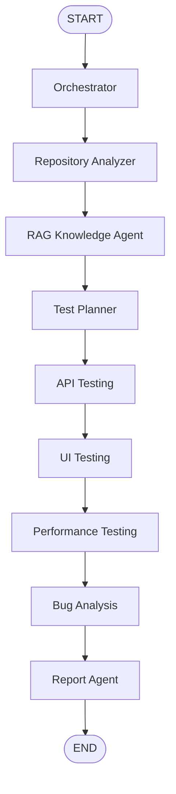

# Final Architecture

## Final Workflow

```text
START -> orchestrator -> repo_analyzer -> rag -> test_planner -> api_testing -> ui_testing -> performance_testing -> bug_analysis -> report -> END
```



## Flask Dashboard Layer

The dashboard is a Flask/Jinja interface. It collects repository input, target
URL, test preferences, MCP options, and planner mode. It starts the LangGraph
workflow and displays final KPIs, artifact paths, execution logs, and the
generated HTML report.

## LangGraph Orchestration Layer

LangGraph State is the shared workflow memory. Each node reads only the fields
it needs and returns a partial State update. Conditional routing keeps agents
skippable when inputs are missing or when safe skip flags are enabled.

## Agent Layer

- Orchestrator validates the request and selects agents.
- Repository Analyzer inspects the repository with deterministic heuristics.
- RAG Knowledge Agent prepares grounded context.
- Test Planner creates grounded API/UI/performance plans.
- API Testing Agent executes planned safe HTTP requests.
- UI Testing Agent executes planned Selenium checks.
- Performance Testing Agent runs small safe Locust checks.
- Bug Analysis Agent classifies API/UI/performance anomalies.
- Report Agent builds final JSON, dashboard payload, and HTML report.

## Tool Layer

The project uses local Python tools by default. Optional MCP tools are available
for selected Repository Analyzer, API Testing, and Report operations. If MCP is
unavailable, agents fall back to local tools.

## Persistence

Each run writes artifacts under:

```text
results/runs/<run_id>/
```

Generated HTML reports are written under:

```text
reports/generated/
```

## GitHub Input Flow

Public GitHub URLs are cloned through normal Git commands and do not require a
GitHub API token. Local `repo_path` is preferred when provided. Private
repository support can use `GITHUB_TOKEN` from `.env`, but tokens are never
entered in the dashboard or printed.

## RAG Flow

Repository files are selected, chunked, embedded with deterministic local hash
embeddings, stored in a JSON vector index, and retrieved for the planner query.
No external vector database is required.

## LLM Planner Mode

The planner uses Groq or Mistral by default through environment variables.
Deterministic planning remains a safety fallback if the LLM call fails.
Validation scripts never print raw keys.

## Security Rules

- Do not execute target repository code.
- Do not start Django, Docker, or external services automatically.
- Do not expose API keys, tokens, cookies, passwords, session IDs, or headers.
- Skip external performance targets unless explicitly allowed.
- Use safe API methods by default.

## Limitations

- Repository analysis is heuristic.
- UI checks are simple Selenium assertions, not autonomous exploration.
- Performance tests use small local Locust loads.
- Dashboard execution is synchronous.
- Authentication flows are not automatic.

## Future Work

- CI/CD integration.
- GitHub PR creation.
- Advanced authentication setup.
- Advanced UI selector strategy.
- Production RAG backend.
- Async dashboard job queue.
