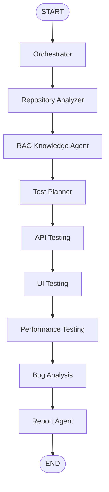

# Final Demo Guide

This guide is for the final PFA demonstration of the LangGraph-Based
Multi-Agent System for Automated Software Testing.

## Final Workflow

```text
START -> orchestrator -> repo_analyzer -> rag -> test_planner -> api_testing -> ui_testing -> performance_testing -> bug_analysis -> report -> END
```



## Demo Setup

Use the project virtual environment.

```powershell
cd sma_test_automation
.venv\Scripts\activate
python scripts/final_smoke_test.py
python scripts/validate_notebook_env.py
python scripts/validate_github_input.py --repo-url "https://github.com/Vitaee/DjangoRestAPI"
python scripts/validate_llm_config.py
python scripts/check_no_secrets.py
python mcp_servers/testing_tools_server.py --self-test
```

## Dashboard Demo

Start the dashboard:

```powershell
python app.py
```

Open:

```text
http://127.0.0.1:5000
```

Recommended settings:

- Repository URL: `https://github.com/Vitaee/DjangoRestAPI`
- Target URL: `http://localhost:8000`
- Test types: API, UI, Performance
- Planner mode: LLM planner
- MCP tools: optional
- External performance target: unchecked

## CLI Demo

Run the full workflow:

```powershell
python -m test_auto.main --repo-url "https://github.com/Vitaee/DjangoRestAPI" --target-url "http://localhost:8000" --test-types api ui performance --execution-mode sequential --focus "JWT authentication todo CRUD API tests"
```

Expected outputs:

```text
results/runs/<run_id>/workflow_state.json
results/runs/<run_id>/api_result.json
results/runs/<run_id>/ui_result.json
results/runs/<run_id>/performance_result.json
results/runs/<run_id>/bug_result.json
results/runs/<run_id>/final_results.json
reports/generated/report_<run_id>.html
```

## Notebook Evidence

Open notebooks in VS Code using the `Python (sma-test-auto)` kernel.

Useful trace notebooks:

- `notebooks/00_environment_validation.ipynb`
- `notebooks/18_ui_integration_trace.ipynb`
- `notebooks/19_performance_testing_agent_trace.ipynb`
- `notebooks/20_performance_integration_trace.ipynb`

## Safety Notes

- The system does not start Django, Docker, or target repository code.
- Performance tests use small Locust loads.
- External performance targets are skipped unless explicitly allowed.
- LLM planning is enabled by default and reads Groq/Mistral settings from
  environment variables.
- Secrets are never printed by validation scripts, dashboard summaries, reports,
  notebooks, or JSON artifacts.

## Final Checklist

- `pytest` passes.
- `python scripts/final_smoke_test.py` passes.
- `python scripts/validate_notebook_env.py` passes.
- `python mcp_servers/testing_tools_server.py --self-test` returns status `ok`.
- Dashboard starts with `python app.py`.
- Final report opens in the dashboard.
- README shows the final workflow and next step as final polishing/demo.

